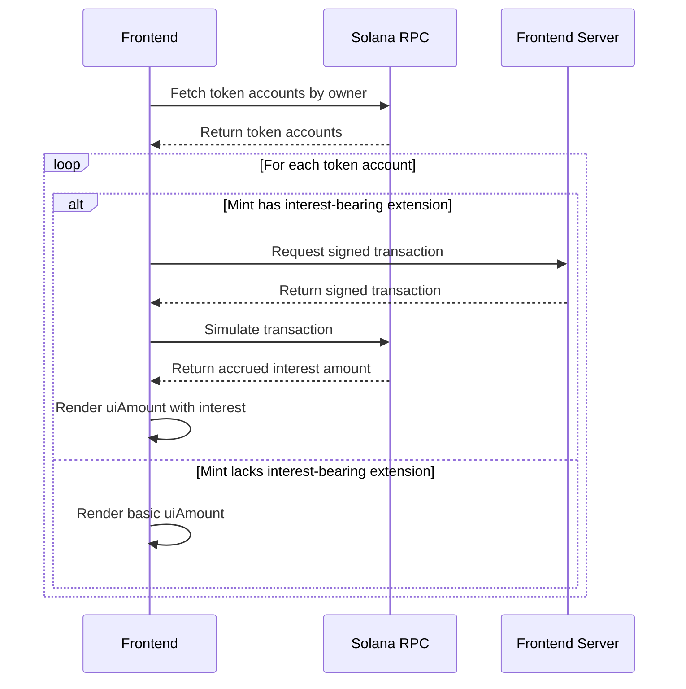

# li-sol

## What is this?

This is a React app to view Solana account balances affected by the Interest Bearing token extension.

This project is generated with the [create-solana-dapp](https://github.com/solana-developers/create-solana-dapp) generator.

Only the following changes have been made to the generated project:

- [Removed uneeded `Basic Program` tab](https://github.com/kilogold/li-sol/commit/d4828b561fc07fac309805cbc906ce3a22dac10a) from the nav bar.
- [Altered how token amounts are fetched](https://github.com/kilogold/li-sol/commit/b2f8d2fc00ef16e8c3457be357198bda069673c6) from the network, based on token extension.
- [Created a server-side route](https://github.com/kilogold/li-sol/commit/f633922af9d5014c30b05d5979072f9107f6bd1b) to produce a signed transaction for [simulating `amountToUiAmount` calls](https://solana.com/developers/courses/token-extensions/interest-bearing-token#fetching-accumulated-interest).

## Why do I need this?
This project is a UX example on how to fetch & display token balances where interest bearing tokens are involved.

dApps, wallets, explorers, and any other Solana app interacting with Interest Bearing token extension requires alternate handling of balance fetching:



## How do I use this?

### Prerequisites

- Node v18.18.0 or higher

### Installation

Clone the repo

```shell
git clone <repo-url>
cd <repo-name>
```

Install Dependencies

```shell
pnpm install
```

### Commands

Start the web app

```shell
pnpm dev
```

Build the web app

```shell
pnpm build
```

### Usage


* Connect your wallet.
* Click on the `Account` tab to view your token balances.

Alternatively, you can access arbitrary accounts by entering their public key in the URL:
```
http://localhost:3000/account/YOUR_PUBLIC_KEY
```
